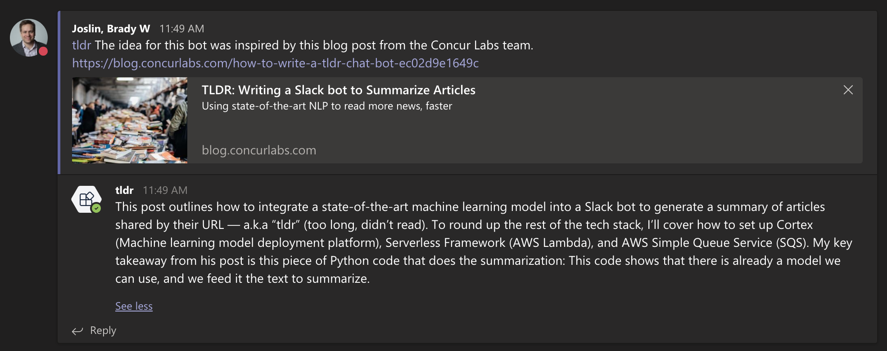

# TL;DR MS Teams Bot

@mention the tldr (“Too Long; Didn't Read”) bot in a post or comment in MS Teams with a message containing a URL and to get a threaded reply with a 3 sentence summary of the web page.

tldr is a [MS Teams outgoing webhook bot](https://docs.microsoft.com/en-us/microsoftteams/platform/webhooks-and-connectors/how-to/add-outgoing-webhook) that runs as a [Cloudflare Worker](https://workers.dev) and calls an [Algorithmia](https://algorithmia.com/)-hosted algorithm that performs the summarization.

The idea for this bot was inspired by a [blog post from the Concur Labs team](https://blog.concurlabs.com/how-to-write-a-tldr-chat-bot-ec02d9e1649c).

## Implementation Details

When a configured outgoing webhook bot is @mentioned in MS Teams a POST request is sent to the worker. The worker verifies the webhook message signature using an HMAC token provided by MS Teams when [creating the outgoing webhook](https://docs.microsoft.com/en-us/microsoftteams/platform/webhooks-and-connectors/how-to/add-outgoing-webhook#create-an-outgoing-webhook).

The worker extracts the first URL found in the message text and sends that URL to the [SummarizeURL](https://algorithmia.com/algorithms/nlp/SummarizeURL) algorithm hosted on Algorithmia.

The worker replies with a JSON response that gets rendered as a threaded reply to the conversation in MS Teams:

```json
{
  "type": "message",
  "text": "The contents of a summary reply!"
}
```

## Usage and Deployment

1. Create a Cloudflare account at [workers.dev](https://workers.dev) if you don't already have one.

1. Edit the `wrangler.toml` file with your Cloudflare `accountid`.

1. Create an outgoing webhook in MS Teams [(docs)](https://docs.microsoft.com/en-us/microsoftteams/platform/webhooks-and-connectors/how-to/add-outgoing-webhook#create-an-outgoing-webhook), providing the URL for your worker.

1. Add a [worker secret variable](https://developers.cloudflare.com/workers/tooling/wrangler/secrets/) named `SECRET` equal to the HMAC security token provided by MS Teams when creating the ougoing webhook. This can be configured using Wrangler:

   ```bash
   wrangler secret put SECRET
   ```

1. Sign up for a free account at [Algorithmia](https://algorithmia.com/) and obtain an API key.

1. Add a [worker secret variable](https://developers.cloudflare.com/workers/tooling/wrangler/secrets/) named `ALGO_KEY` equal to the Algorithmia API Key.

   ```bash
   wrangler secret put ALGO_KEY
   ```



🎉

## TODO

Create GitHub Activity for automated deployments.
